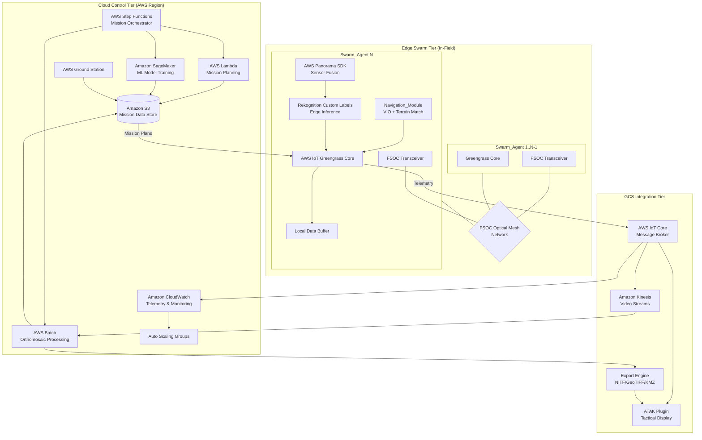
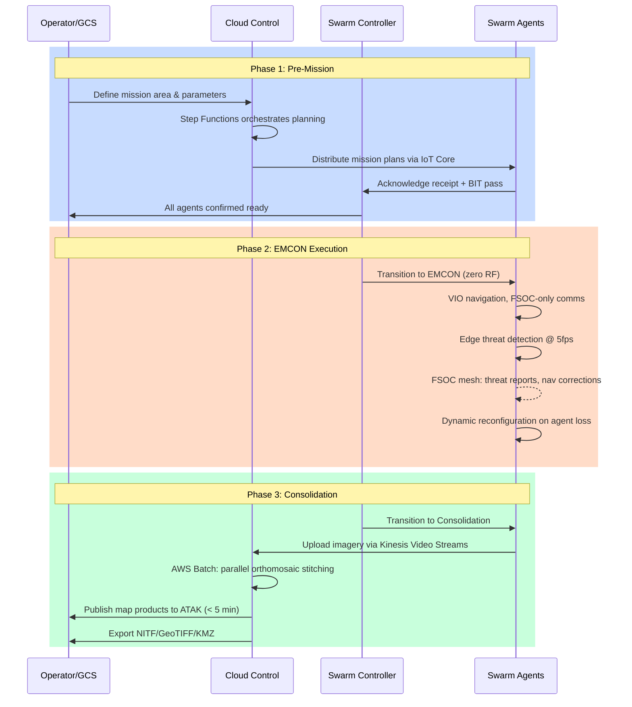
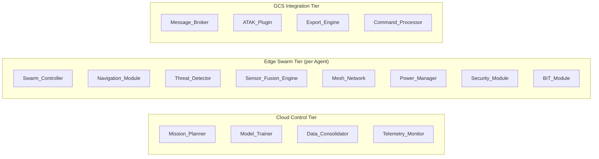
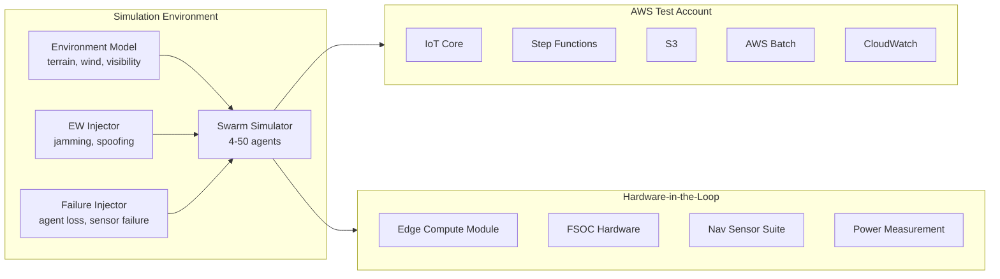

# Design Document: Autonomous Drone Swarm Battlefield Mapping System (ADSBMS)

## Overview

The ADSBMS ("Project ARGUS") is a three-tier AWS-native system enabling autonomous drone swarms to collaboratively map 10 km² battlefield terrain in GPS-denied, EMCON-restricted environments. The architecture spans Cloud Control (pre/post-mission AWS services), Edge Swarm (autonomous in-mission processing), and GCS Integration (operator interface and data export).

**Key Design Decisions:**

1. **Edge-first autonomy**: All in-mission decision-making runs locally on Swarm_Agents. The system operates independently of cloud connectivity during EMCON Execution, with full mission logic pre-loaded before launch.
2. **FSOC optical mesh for EMCON**: Inter-agent communication uses Free Space Optical links to achieve zero RF emissions during the execution phase, with dynamic relay routing for line-of-sight obstructions.
3. **Distributed consensus for swarm coordination**: The Swarm_Controller logic is distributed across agents using a leader-election + gossip protocol, avoiding single points of failure.
4. **AWS Greengrass component model**: Edge software is packaged as independently versioned Greengrass components, enabling modular updates without full redeployment.
5. **Parallel orthomosaic stitching via AWS Batch**: Post-mission imagery processing uses array jobs with scatter-gather parallelization to meet the 45-minute consolidation window.

**Design Rationale:**

- The three-phase mission model (Pre-Mission → EMCON Execution → Consolidation) cleanly separates connectivity-dependent planning from autonomous execution, enabling the system to function under complete communications denial.
- VIO-primary navigation with terrain-matching and acoustic beacon fusion provides sub-2m CEP accuracy without GPS dependency, while remaining within the 15W SWAP power budget.
- Edge ML inference using Rekognition Custom Labels on Greengrass Core allows real-time threat detection at 5 fps without cloud connectivity, satisfying the tactical immediacy requirement.

## Architecture

### System Architecture Diagram



### Three-Phase Mission Execution Flow



### Tier Interaction Model

| Tier | Phase | Connectivity | Primary Functions |
|------|-------|-------------|-------------------|
| Cloud Control | Pre-Mission | Full | Planning, model deployment, config distribution |
| Cloud Control | EMCON Execution | None | Idle (no connectivity to swarm) |
| Cloud Control | Consolidation | Full | Orthomosaic processing, model retraining |
| Edge Swarm | Pre-Mission | Full (RF) | Plan receipt, BIT, configuration |
| Edge Swarm | EMCON Execution | FSOC only | Navigation, mapping, threat detection |
| Edge Swarm | Consolidation | Full (RF) | Data upload, synchronization |
| GCS Integration | Pre-Mission | Full | Operator commands, launch authorization |
| GCS Integration | EMCON Execution | None (estimated progress display) | Last-known-state display |
| GCS Integration | Consolidation | Full | Real-time status, export, ATAK updates |

## Components and Interfaces

### Component Hierarchy



### Component Interface Definitions

#### 1. Mission_Planner (Cloud Control Tier)

**Responsibility**: Generate optimized flight plans, sector assignments, and contingency plans.

| Interface | Direction | Protocol | Payload |
|-----------|-----------|----------|---------|
| `generatePlan(missionArea, agents, envParams)` | Lambda invocation | JSON/REST | MissionPlan |
| `distributePlan(plan, agentList)` | IoT Core MQTT | MQTT QoS 1 | MissionPackage |
| `reportPlanFailure(cause, constraints)` | Step Functions callback | JSON | FailureReport |

```typescript
interface MissionPlan {
  missionId: string;
  area: GeoPolygon;              // WGS-84 polygon up to 10 km²
  sectorAssignments: SectorAssignment[];
  flightPaths: FlightPath[];
  contingencyPlans: ContingencyPlan[];   // For up to 30% agent loss
  environmentParams: EnvironmentParams;
  createdAt: ISO8601Timestamp;
  expiresAt: ISO8601Timestamp;
}

interface SectorAssignment {
  agentId: string;
  sectorId: string;
  sectorPolygon: GeoPolygon;
  priority: number;              // 1 = highest
  requiredOverlap: number;       // percentage (30% nominal, 15% degraded)
  flightAltitude: number;        // meters AGL
  groundSpeed: number;           // m/s
}

interface FlightPath {
  agentId: string;
  waypoints: Waypoint[];
  estimatedDuration: number;     // seconds
  estimatedEnergy: number;       // joules
}

interface ContingencyPlan {
  triggerCondition: string;      // e.g., "agent_loss_10_percent"
  reassignments: SectorAssignment[];
  minimumOverlap: number;       // 15% for degraded mode
}
```

#### 2. Navigation_Module (Edge Swarm Tier)

**Responsibility**: GPS-denied positioning using VIO, terrain matching, and acoustic beacons.

| Interface | Direction | Protocol | Rate |
|-----------|-----------|----------|------|
| `getPosition()` | Internal | Function call | 10 Hz |
| `reportDegradedNav(status)` | To Swarm_Controller | Greengrass IPC | On event |
| `injectAcousticMeasurement(range, beaconId)` | From acoustic subsystem | Internal | Variable |
| `injectTerrainMatch(correctedPos)` | From terrain matcher | Internal | On correction |

```typescript
interface NavigationState {
  position: WGS84Position;       // lat, lon, alt
  velocity: Vector3D;            // m/s NED frame
  attitude: Quaternion;          // orientation
  positionUncertainty: number;   // meters CEP
  navigationMode: 'GPS' | 'VIO_PRIMARY' | 'VIO_TERRAIN' | 'VIO_ACOUSTIC' | 'DEGRADED';
  driftAccumulated: number;      // meters since last correction
  timestamp: number;             // microseconds since epoch
  sensorHealth: {
    vio: 'NOMINAL' | 'DEGRADED' | 'FAILED';
    terrainMatch: 'NOMINAL' | 'DEGRADED' | 'FAILED';
    acousticBeacon: 'NOMINAL' | 'UNAVAILABLE';
  };
}

interface TerrainMatchRequest {
  currentVIOPosition: WGS84Position;
  currentImageFeatures: FeatureDescriptor[];
  terrainModelId: string;
  searchRadius: number;          // meters
}
```

#### 3. Threat_Detector (Edge Swarm Tier)

**Responsibility**: Real-time ML inference for threat classification at the edge.

| Interface | Direction | Protocol | Rate |
|-----------|-----------|----------|------|
| `processFrame(fusedFrame)` | From Sensor_Fusion_Engine | Internal | 5 fps |
| `disseminateThreat(report)` | To Mesh_Network | Greengrass IPC → FSOC | On detection |
| `correlateThreat(detections[])` | From Swarm_Controller | Internal | On multi-agent detection |

```typescript
interface ThreatReport {
  reportId: string;
  threatType: ThreatClassification;
  confidence: number;            // 0.0 - 1.0 (minimum 0.85 for dissemination)
  location: WGS84Position;
  timestamp: ISO8601Timestamp;
  detectingAgentId: string;
  sensorModalities: ('EO' | 'IR' | 'LIDAR')[];
  boundingBox: BoundingBox;
  imageChipHash: string;         // SHA-256 of source image chip
}

interface ConsolidatedThreatTrack {
  trackId: string;
  reports: ThreatReport[];       // correlated detections from multiple agents
  consolidatedConfidence: number; // min(max_individual + 0.05, 0.99)
  centroidLocation: WGS84Position;
  firstDetectedAt: ISO8601Timestamp;
  lastUpdatedAt: ISO8601Timestamp;
}

type ThreatClassification = 
  | 'VEHICLE_ARMORED'
  | 'VEHICLE_UNARMORED'
  | 'PERSONNEL'
  | 'EMPLACEMENT'
  | 'AIRCRAFT'
  | 'WATERCRAFT'
  | 'UNKNOWN';
```

#### 4. Sensor_Fusion_Engine (Edge Swarm Tier)

**Responsibility**: Multi-sensor data fusion (EO, IR, LIDAR) into unified scene representation.

```typescript
interface FusedFrame {
  frameId: number;
  timestamp: number;
  electro_optical: ImageTensor | null;   // null if sensor degraded
  infrared: ImageTensor | null;
  lidar: PointCloud | null;
  fusedScene: UnifiedSceneRepresentation;
  degradedSensors: string[];     // list of unavailable sensor types
  metadata: {
    agentPosition: WGS84Position;
    agentAttitude: Quaternion;
    groundSampleDistance: number; // meters/pixel
  };
}
```

#### 5. Mesh_Network (Edge Swarm Tier)

**Responsibility**: Resilient inter-agent communication via FSOC mesh with priority-based routing.

```typescript
interface MeshNetworkConfig {
  mode: 'EMCON_FSOC_ONLY' | 'RF_AUTHORIZED' | 'HYBRID';
  priorityScheme: DataPriority[];
  encryptionType: 'NSA_TYPE1';
  maxRelayHops: number;
  heartbeatInterval: number;     // milliseconds
  linkTimeoutThreshold: number;  // 5000ms for agent-lost declaration
}

enum DataPriority {
  THREAT_REPORT = 1,             // Highest - preempts all
  NAVIGATION_CORRECTION = 2,
  HEALTH_STATUS = 3,
  IMAGERY_DATA = 4               // Lowest - compressed/buffered under constraint
}

interface LinkStatus {
  peerId: string;
  linkType: 'FSOC' | 'RF_LPILPD';
  bandwidth: number;             // Mbps
  bitErrorRate: number;
  signalQuality: number;         // 0.0 - 1.0
  latency: number;               // milliseconds
  lastHeartbeat: number;         // timestamp
}
```

#### 6. Swarm_Controller (Distributed across Edge Swarm Tier)

**Responsibility**: Distributed coordination, reconfiguration, and phase management.

```typescript
interface SwarmState {
  missionPhase: 'PRE_MISSION' | 'EMCON_EXECUTION' | 'CONSOLIDATION';
  activeAgents: AgentStatus[];
  lostAgents: string[];
  coverageStatus: CoverageMetrics;
  reconfigurationHistory: ReconfigEvent[];
  currentLeader: string;         // agent ID of elected leader
}

interface AgentStatus {
  agentId: string;
  batteryPercent: number;
  navigationMode: string;
  sensorHealth: SensorHealthMap;
  assignedSector: string;
  sectorProgress: number;        // 0.0 - 1.0
  meshConnectivity: number;      // count of reachable peers
  lastHeartbeat: number;
}

interface ReconfigEvent {
  timestamp: ISO8601Timestamp;
  trigger: 'AGENT_LOST' | 'THREAT_DETECTED' | 'SENSOR_DEGRADED' | 'BATTERY_LOW';
  affectedAgents: string[];
  reassignments: SectorAssignment[];
  resultingOverlap: number;      // percentage achieved
}
```

#### 7. Data_Consolidator (Cloud Control Tier)

**Responsibility**: Parallel orthomosaic stitching and multi-format export.

```typescript
interface ConsolidationJob {
  missionId: string;
  inputBucket: string;
  inputPrefix: string;
  imageSets: ImageSet[];         // grouped by sector
  navigationLogs: NavigationLog[];
  targetGSD: number;             // 0.10 meters
  targetDatum: 'WGS84';
  outputFormats: ('NITF' | 'GeoTIFF' | 'KMZ')[];
  threatOverlays: ConsolidatedThreatTrack[];
  maxProcessingTime: number;     // 2700 seconds (45 min)
}

interface OrthomosaicProduct {
  missionId: string;
  coveragePolygon: GeoPolygon;
  unmappedAreas: GeoPolygon[];   // areas not covered or unprocessable
  geoRegistrationError: number;  // meters CEP
  groundSampleDistance: number;
  outputFiles: {
    nitf: S3Uri;
    geotiff: S3Uri;
    kmz: S3Uri;
  };
  threatLayer: ThreatOverlay;
  metadata: ExportMetadata;
  processingDuration: number;    // seconds
}
```

#### 8. Security_Module (Edge Swarm Tier)

**Responsibility**: Encryption, authentication, key management, and audit trail.

```typescript
interface SecurityConfig {
  encryptionAtRest: 'AES-256';
  commsEncryption: 'NSA_TYPE1';
  transportSecurity: 'TLS_1_3';
  signatureAlgorithm: 'ECDSA_P384';
  keyZeroizationTimeout: number;  // 5000ms primary, 15000ms escalation
}

interface AuditEntry {
  entryId: string;
  agentId: string;
  timestamp: ISO8601Timestamp;
  position: WGS84Position;
  operation: string;
  dataItemHash: string;          // SHA-256
  previousHash: string;          // chain integrity
}
```

### Inter-Tier API Contracts (Versioned)

```typescript
// v1 API contract between tiers
interface CloudToEdgeAPI_v1 {
  distributeMissionPlan(plan: MissionPlan): Promise<AckResponse>;
  deployModel(modelArtifact: S3Uri, targetAgents: string[]): Promise<DeployStatus>;
  issueCommand(command: OperatorCommand): Promise<CommandAck>;
}

interface EdgeToCloudAPI_v1 {
  uploadTelemetry(batch: TelemetryBatch): Promise<void>;
  uploadImagery(stream: ImageryStream): Promise<UploadStatus>;
  reportMissionStatus(status: MissionStatus): Promise<void>;
  reportThreat(threat: ThreatReport): Promise<void>;
}

interface EdgeToGCSAPI_v1 {
  publishSwarmState(state: SwarmState): Promise<void>;
  publishThreat(threat: ConsolidatedThreatTrack): Promise<void>;
  acknowledgCommand(ack: CommandAck): Promise<void>;
}
```

## Data Models

### Mission Data Schema

```typescript
// Core mission entity stored in S3 with versioning
interface Mission {
  missionId: string;             // UUID v4
  status: MissionStatus;
  createdAt: ISO8601Timestamp;
  startedAt: ISO8601Timestamp | null;
  completedAt: ISO8601Timestamp | null;
  configuration: MissionConfiguration;
  plan: MissionPlan;
  results: MissionResults | null;
  auditTrail: AuditEntry[];
}

type MissionStatus = 
  | 'PLANNING'
  | 'PLAN_DISTRIBUTED'
  | 'PRE_MISSION'
  | 'EMCON_EXECUTION'
  | 'CONSOLIDATION'
  | 'COMPLETED'
  | 'ABORTED'
  | 'FAILED';

interface MissionConfiguration {
  swarmSize: number;             // 4-50 agents
  missionArea: GeoPolygon;
  missionDuration: number;       // seconds (max 7200 = 2hr)
  environmentParams: EnvironmentParams;
  prioritySectors: PrioritySector[];
  emconLevel: 'LEVEL_I' | 'LEVEL_II' | 'LEVEL_III';
}

interface EnvironmentParams {
  windSpeed: number;             // knots
  windDirection: number;         // degrees true
  temperature: number;           // Celsius
  visibility: number;            // km
  terrainElevationModel: S3Uri;
  threatIntelOverlay: S3Uri | null;
}
```

### Agent Telemetry Schema

```typescript
interface TelemetryFrame {
  agentId: string;
  missionId: string;
  timestamp: ISO8601Timestamp;
  navigation: NavigationState;
  power: PowerState;
  sensors: SensorState;
  communication: CommState;
  compute: ComputeState;
}

interface PowerState {
  batteryPercent: number;        // 0-100, ±2% accuracy
  powerConsumption: number;      // watts (rolling 60s average)
  estimatedRemainingFlight: number; // seconds
  mode: 'NOMINAL' | 'REDUCED_POWER' | 'CRITICAL';
  subsystemPower: {
    compute: number;             // watts
    sensors: number;
    communications: number;
    flightController: number;
  };
}

interface SensorState {
  electroOptical: SensorStatus;
  infrared: SensorStatus;
  lidar: SensorStatus;
  frameRate: number;             // current fps
  imageQuality: number;          // 0.0-1.0 metric
}

type SensorStatus = 'NOMINAL' | 'DEGRADED' | 'FAILED';

interface CommState {
  meshMode: 'EMCON_FSOC_ONLY' | 'RF_AUTHORIZED';
  connectedPeers: number;
  linkStatuses: LinkStatus[];
  bufferedDataSize: number;      // bytes pending transmission
  bandwidthAvailable: number;    // Mbps aggregate
}
```

### S3 Data Organization

```
s3://argus-mission-data-{account-id}/
├── missions/
│   └── {mission-id}/
│       ├── plan/
│       │   ├── mission-plan.json
│       │   ├── flight-paths/
│       │   └── contingency-plans/
│       ├── telemetry/
│       │   └── {agent-id}/
│       │       └── {timestamp}-telemetry.parquet
│       ├── imagery/
│       │   └── {agent-id}/
│       │       └── {sector-id}/
│       │           └── {frame-id}.enc  (AES-256 encrypted)
│       ├── threats/
│       │   ├── individual/
│       │   └── consolidated/
│       ├── products/
│       │   ├── orthomosaic.nitf
│       │   ├── orthomosaic.tif
│       │   ├── orthomosaic.kmz
│       │   └── threat-overlay.geojson
│       ├── audit/
│       │   └── provenance-chain.jsonl
│       └── logs/
│           ├── swarm-controller/
│           └── ew-events/
├── models/
│   └── threat-detector/
│       └── {version}/
│           ├── model.tar.gz
│           └── metadata.json
└── config/
    └── agent-fleet/
        └── {agent-id}/
            └── agent-config.json
```

### Data Retention and Lifecycle

| Data Category | Retention | Storage Class | Encryption |
|---------------|-----------|---------------|------------|
| Mission Plans | 7 years | S3 Standard → IA (90d) → Glacier (1yr) | AES-256 SSE-S3 |
| Telemetry | 7 years | S3 Standard → IA (30d) → Glacier (90d) | AES-256 SSE-S3 |
| Raw Imagery | 7 years | S3 Standard → IA (30d) → Glacier (90d) | AES-256 SSE-KMS |
| Map Products | 7 years | S3 Standard (permanent) | AES-256 SSE-KMS |
| Threat Reports | 7 years | S3 Standard → IA (180d) | AES-256 SSE-KMS |
| Audit Trail | 7 years | S3 Standard (immutable - Object Lock) | AES-256 SSE-KMS |
| ML Models | Active version + 5 previous | S3 Standard | AES-256 SSE-KMS |


## Correctness Properties

*A property is a characteristic or behavior that should hold true across all valid executions of a system—essentially, a formal statement about what the system should do. Properties serve as the bridge between human-readable specifications and machine-verifiable correctness guarantees.*

### Property 1: Flight Path Coverage Completeness

*For any* valid mission area polygon (up to 10 km²) and agent count (4–50), the generated flight paths SHALL collectively cover 100% of the mission area with a minimum 30% image overlap between adjacent flight strips.

**Validates: Requirements 1.2**

### Property 2: Environmental Adjustment Preserves Coverage Invariant

*For any* set of environmental parameters (wind speed, terrain elevation, threat overlay) applied to a valid flight plan, the adjusted flight paths SHALL maintain at minimum 30% image overlap and remain within the operational flight envelope (altitude, speed, turn radius) of each assigned Swarm_Agent.

**Validates: Requirements 1.4**

### Property 3: Contingency Plan Coverage Under Agent Loss

*For any* subset of agents removed (up to 30% of total), the contingency plan SHALL reassign all sectors to remaining agents achieving complete area coverage with at minimum 15% image overlap.

**Validates: Requirements 1.5**

### Property 4: Mission Phase Ordering Invariant

*For any* sequence of mission events, the ADSBMS phase state machine SHALL only transition in the order Pre-Mission → EMCON Execution → Consolidation, never skipping or reversing phases.

**Validates: Requirements 2.1**

### Property 5: Phase Transition Requires Agent Quorum

*For any* set of agent readiness states, the transition from Pre-Mission to EMCON Execution SHALL occur only when all confirmed agents have passed BIT AND at least 70% of total agents are confirmed ready. If fewer than 70% are ready, the system SHALL abort.

**Validates: Requirements 2.2, 2.6, 2.7**

### Property 6: EMCON-to-Consolidation Transition Conditions

*For any* combination of sector completion states, the transition from EMCON Execution to Consolidation SHALL occur if and only if (all sectors are mapped to required overlap) OR (all available agents have completed their paths) OR (a recall command is received).

**Validates: Requirements 2.4**

### Property 7: VIO Navigation Accuracy Under Drift

*For any* flight trajectory with simulated sensor noise, the Navigation_Module using VIO SHALL maintain positional accuracy within 2 meters CEP, and when drift exceeds 1 meter, terrain matching SHALL reduce error below 0.5 meters.

**Validates: Requirements 3.1, 3.2**

### Property 8: Acoustic Beacon Position Bounding

*For any* geometric arrangement of 3 or more acoustic beacons within range of a Swarm_Agent, the Navigation_Module SHALL bound position uncertainty to within 1 meter using trilateration fusion.

**Validates: Requirements 3.3**

### Property 9: Navigation Filter Fusion Produces Valid Output

*For any* valid combination of VIO, terrain-match, and acoustic beacon sensor inputs, the weighted estimation filter SHALL produce a unified position solution that is a valid WGS-84 coordinate with uncertainty bounded by the best available sensor input.

**Validates: Requirements 3.5**

### Property 10: FSOC Mesh Rerouting on Link Failure

*For any* mesh network topology where an alternate path exists between two nodes, if the direct FSOC link between those nodes is interrupted, the Mesh_Network SHALL discover and activate an alternate relay path.

**Validates: Requirements 4.3**

### Property 11: Data Buffering Integrity During Isolation

*For any* data items queued for transmission when a Swarm_Agent becomes isolated, the Mesh_Network SHALL buffer all items with zero data loss, and upon path restoration deliver all buffered items in priority order.

**Validates: Requirements 4.7**

### Property 12: Threat Detection Confidence Threshold Gate

*For any* detection output from the Threat_Detector, the system SHALL disseminate only detections with confidence ≥ 85% as threat reports, and SHALL retain detections below 85% locally for 30 seconds for correlation without external dissemination.

**Validates: Requirements 5.2, 5.7**

### Property 13: Threat Report Completeness

*For any* classified threat, the generated threat report SHALL contain all required fields: threat type, confidence score, geolocation coordinates, timestamp, and detecting agent identifier.

**Validates: Requirements 5.3**

### Property 14: Sensor Fusion Degraded Mode Continuity

*For any* single sensor failure (one of EO, IR, or LIDAR), the Sensor_Fusion_Engine SHALL continue producing a valid scene representation from the remaining available sensors and flag the output as degraded-fidelity.

**Validates: Requirements 5.8**

### Property 15: Multi-Agent Threat Correlation Confidence Boost

*For any* set of threat detections from multiple agents within a 50-meter spatial radius and 10-second temporal window, the Swarm_Controller SHALL produce a single consolidated track with confidence equal to min(max_individual_confidence + 0.05, 0.99).

**Validates: Requirements 5.6**

### Property 16: Tiered Graceful Degradation Under Agent Loss

*For any* percentage of agent loss: (a) at ≤10% loss, the system SHALL maintain 30% image overlap and full 10cm GSD coverage; (b) at 10–30% loss, the system SHALL maintain complete coverage with ≥15% overlap at 10cm GSD; (c) at >30% loss, the system SHALL prioritize high-priority sectors and achieve ≥50% total area coverage.

**Validates: Requirements 7.1, 7.2, 7.3, 6.2**

### Property 17: Agent Loss Detection and Sector Redistribution

*For any* Swarm_Agent that ceases heartbeat responses for more than 5 seconds, the Swarm_Controller SHALL declare the agent lost and redistribute its assigned sectors to remaining agents such that all previously assigned sectors have a new assignee.

**Validates: Requirements 6.1**

### Property 18: Threat-Driven Sector Re-Prioritization

*For any* threat classified at ≥85% confidence in an unmapped sector, the Swarm_Controller SHALL reassign at least one Swarm_Agent to map that sector, increasing its priority above previously assigned sectors of lower priority.

**Validates: Requirements 6.3**

### Property 19: Degraded Agent Reassignment

*For any* Swarm_Agent whose sensor frame rate drops below 50% of nominal or whose image quality falls below the orthomosaic threshold, the Swarm_Controller SHALL reassign that agent to a lower-priority sector and allocate a healthy agent as replacement.

**Validates: Requirements 6.4**

### Property 20: Battery Threshold Mode Transitions

*For any* battery depletion curve, the Swarm_Agent SHALL: (a) enter reduced-power mode (≥2fps sensor rate, ≥30% speed reduction) when battery falls below 25%; (b) recall and redistribute tasks when battery falls below 15%; (c) transmit position/data-index and initiate RTB when battery falls below 10%.

**Validates: Requirements 8.3, 7.5, 8.6**

### Property 21: Energy-Optimized Flight Paths

*For any* mission area, the optimized flight paths generated by the Mission_Planner SHALL consume at least 15% less energy than a straight-line constant-altitude traversal of the same coverage area.

**Validates: Requirements 8.4**

### Property 22: Priority-Based Data Transmission with Preemption

*For any* data queue with mixed-priority items (threats, nav corrections, health, imagery) and link utilization exceeding 80%, the Mesh_Network SHALL transmit higher-priority data before lower-priority data, preempting lower-priority transfers in progress.

**Validates: Requirements 9.1**

### Property 23: Progressive Compression Under Bandwidth Constraint

*For any* available bandwidth below 10 Mbps per link, the Mesh_Network SHALL apply progressive compression to imagery data (up to 50:1) while transmitting threat reports and navigation corrections at full fidelity without compression.

**Validates: Requirements 9.2**

### Property 24: On-Board Image Compression Quality Preservation

*For any* raw image captured by a Swarm_Agent, the on-board compression SHALL achieve at least 10:1 size reduction while maintaining minimum structural similarity (SSIM) of 0.7 and preserving 10cm ground sample distance.

**Validates: Requirements 9.3**

### Property 25: Bandwidth-Triggered Local Storage Mode

*For any* inter-agent bandwidth measurement below 2 Mbps, the Swarm_Agent SHALL store imagery data locally rather than transmitting it, and SHALL synchronize all stored imagery during the Consolidation phase.

**Validates: Requirements 9.4**

### Property 26: Priority-Ordered Data Synchronization on Reconnection

*For any* set of buffered data accumulated during a connectivity gap, the ADSBMS SHALL synchronize data in priority order (threat reports first, then mission status, then collected imagery) upon GCS connectivity restoration.

**Validates: Requirements 10.2**

### Property 27: Command Validation Against Current Mission State

*For any* operator command received after a connectivity gap, the Swarm_Controller SHALL validate the command against current mission state and (a) execute it if no conflict exists with active reconfiguration or safety constraints, or (b) reject it with a specific reason if a conflict is detected.

**Validates: Requirements 10.4, 10.5**

### Property 28: GPS Spoofing Detection via VIO Comparison

*For any* GPS position solution and concurrent VIO-derived position estimate, the Navigation_Module SHALL flag a GPS spoofing event when the discrepancy exceeds 10 meters and reject the GPS solution.

**Validates: Requirements 11.3**

### Property 29: EW Event Logging Completeness

*For any* electronic warfare event detected by the system, the ADSBMS SHALL produce a log entry containing millisecond-precision timestamp, agent location, EW event type, and response action taken.

**Validates: Requirements 11.5**

### Property 30: SWAP Power Budget Warning

*For any* software component whose power consumption exceeds 90% of its allocated SWAP power budget for more than 10 consecutive seconds, the Swarm_Agent SHALL generate a SWAP margin warning and reduce non-critical processing to remain within budget.

**Validates: Requirements 12.6**

### Property 31: Data-at-Rest Encryption Invariant

*For any* data item (imagery, sensor data, threat report) written to local storage on a Swarm_Agent, the Security_Module SHALL encrypt the data using AES-256 before writing, such that no plaintext data exists on persistent storage.

**Validates: Requirements 13.1**

### Property 32: Message Authentication Round-Trip

*For any* inter-agent message, the sender SHALL attach a valid digital signature, and the receiver SHALL verify the signature. If verification fails, the receiver SHALL discard the message, log the event with sender identity and timestamp, and notify the Swarm_Controller.

**Validates: Requirements 13.2, 13.7**

### Property 33: Cryptographic Audit Trail Integrity

*For any* data operation (collection, processing, export), the Security_Module SHALL generate an audit entry containing agent identity, timestamp, position estimate, operation type, and cryptographic hash, forming a verifiable hash chain where each entry references the previous entry's hash.

**Validates: Requirements 13.5**

### Property 34: Orthomosaic Coverage Completeness

*For any* set of collected imagery with sufficient overlap from mapped sectors, the Data_Consolidator SHALL produce an orthomosaic covering 100% of the mapped sector areas at ≤10cm ground sample distance.

**Validates: Requirements 14.1**

### Property 35: Export Format Content Equivalence

*For any* orthomosaic product, the NITF, GeoTIFF, and KMZ exports SHALL contain identical geospatial content and metadata such that parsing any of the three formats yields the same geographic coverage polygon, pixel values within a defined tolerance, and threat overlay data.

**Validates: Requirements 14.2**

### Property 36: Partial Coverage Unmapped Area Marking

*For any* mission with partial coverage due to agent losses, the Data_Consolidator SHALL produce a boundary polygon layer that correctly identifies all unmapped areas (areas within the mission polygon not covered by any agent's imagery).

**Validates: Requirements 14.5**

### Property 37: Threat Metadata Embedding in Exports

*For any* set of detected threats, all threat locations and classifications SHALL appear as metadata layers in all exported map products, with each entry containing geospatial coordinates, threat type classification, and confidence score.

**Validates: Requirements 14.6**

### Property 38: Corrupted Imagery Exclusion

*For any* sector data that is corrupted or has insufficient overlap for stitching, the Data_Consolidator SHALL exclude the affected area from the orthomosaic, mark it in the unmapped areas layer as unprocessable, and log the exclusion reason.

**Validates: Requirements 14.7**

### Property 39: Swarm Size Scalability

*For any* swarm size configuration between 4 and 50 agents inclusive, the ADSBMS SHALL accept the configuration and initialize successfully. For any configuration exceeding 50, the ADSBMS SHALL reject with an appropriate error.

**Validates: Requirements 17.1, 17.6**

### Property 40: Sector Assignment Computation Time Proportionality

*For any* swarm size N (4–50), the Swarm_Controller SHALL complete sector assignment computations in time proportional to N, not exceeding 2 seconds per agent (i.e., total time ≤ 2N seconds).

**Validates: Requirements 17.2**

### Property 41: BIT Failure Reporting and Exclusion

*For any* Built-In Test failure detected on a Swarm_Agent, the ADSBMS SHALL report the failure type and affected subsystem within 5 seconds and exclude the failed agent from mission participation without adding more than 10 seconds to the launch sequence.

**Validates: Requirements 18.3**

### Property 42: State Transition Logging Completeness

*For any* internal state transition, decision, or inter-agent message, the ADSBMS SHALL produce a log entry with millisecond-precision timestamp, event type, involved agent(s), and decision rationale.

**Validates: Requirements 18.4**


## Error Handling

### Error Classification

| Severity | Response Time | Examples | Action |
|----------|--------------|----------|--------|
| Critical | < 2 seconds | GPS spoofing detected, total comms loss, >50% agent loss | Immediate autonomous response, mode switch |
| High | < 5 seconds | Agent lost (heartbeat timeout), sensor failure, BIT failure | Reconfiguration, redistribution |
| Medium | < 30 seconds | Battery low, link degradation, partial sensor loss | Graceful degradation, mode transition |
| Low | < 60 seconds | Bandwidth reduction, non-critical SWAP warning | Adaptive behavior, logging |
| Informational | Best effort | Telemetry gaps, non-critical state changes | Logging only |

### Error Handling by Subsystem

#### Navigation_Module Errors

| Error Condition | Detection | Response | Recovery |
|----------------|-----------|----------|----------|
| VIO drift > 1m | Drift accumulator | Trigger terrain matching | Correct to < 0.5m within 5s |
| Terrain match failure | 5s timeout | Report degraded nav | Continue VIO-only, flag uncertainty |
| GPS spoofing (>10m discrepancy) | VIO vs GPS comparison | Reject GPS, switch to VIO-primary | Log EW event, notify Swarm_Controller |
| GPS anomaly | Signal analysis | Switch to VIO within 2s | Continue without GPS |
| All nav sources degraded | Position uncertainty > 5m | Report to Swarm_Controller | Continue with elevated uncertainty flag |

#### Mesh_Network Errors

| Error Condition | Detection | Response | Recovery |
|----------------|-----------|----------|----------|
| FSOC LOS obstruction | Link quality drop | Reroute through relay (< 500ms) | Auto-recover on LOS restoration |
| Complete agent isolation | No path to any peer | Buffer all data locally | Attempt reconnection every 5s |
| RF jamming (SNR drop ≥ 20dB) | Signal monitoring | Switch to FSOC-only (< 1s) | Monitor RF, restore when safe |
| Optical dazzle (BER > 10⁻³) | Bit error monitoring | Reroute affected links (< 500ms) | Auto-recover on interference cessation |
| Bandwidth < 2 Mbps | 5s measurement cycle | Store imagery locally | Sync during Consolidation |
| Message authentication failure | Signature verification | Discard message, log, notify controller | Continue with authenticated messages only |

#### Swarm_Controller Errors

| Error Condition | Detection | Response | Recovery |
|----------------|-----------|----------|----------|
| Agent heartbeat timeout (> 5s) | Heartbeat monitor | Declare lost, redistribute sectors (< 30s) | Accept agent back if it reappears |
| < 70% agents ready at launch | 10-minute timeout | Abort mission, report to operator | Require operator re-initiation |
| > 50% agents lost mid-mission | Agent count monitor | Report critical degradation, focus on highest-priority sector | Continue until battery threshold |
| Conflicting operator command | State validation | Reject command, report reason | Continue current execution |
| Leader node failure | Heartbeat / election | Trigger leader re-election (< 5s) | New leader assumes coordination |

#### Threat_Detector Errors

| Error Condition | Detection | Response | Recovery |
|----------------|-----------|----------|----------|
| Inference latency > 200ms/frame | Frame timing | Drop frames to maintain 5fps | Alert if sustained > 10s |
| Model load failure | Greengrass health check | Fall back to previous model version | Report stale model status |
| OOM during inference | Memory monitor | Restart inference component | Log and reduce batch size |
| Sub-threshold detection | Confidence < 85% | Retain locally for 30s correlation | Expire after 30s if uncorrelated |

#### Power_Manager Errors

| Error Condition | Detection | Response | Recovery |
|----------------|-----------|----------|----------|
| Battery < 25% | 30s polling | Enter reduced-power mode | N/A (irreversible depletion) |
| Battery < 15% | 30s polling | Recall agent, redistribute tasks | N/A |
| Battery < 10% | 30s polling | Transmit position, initiate RTB | N/A |
| SWAP budget > 90% for > 10s | 1s power monitor | Warn controller, reduce non-critical load | Restore when consumption normalizes |
| Total power > 25W (excl. propulsion) | Continuous monitoring | Shed lowest-priority workload | Restore when within budget |

#### Data_Consolidator Errors

| Error Condition | Detection | Response | Recovery |
|----------------|-----------|----------|----------|
| Corrupted imagery sector | Integrity check / overlap analysis | Exclude sector, mark unprocessable | Log exclusion reason |
| Insufficient overlap for stitching | Geometric validation | Exclude area, add to unmapped layer | N/A |
| Processing timeout approaching 45 min | Job progress monitor | Prioritize high-priority sectors, reduce quality for remaining | Deliver partial product |
| Batch job failure | AWS Batch status | Retry failed job (max 3 attempts) | Report failure if retries exhausted |

### Cascading Failure Prevention

1. **Circuit breaker pattern**: Each subsystem has independent error budgets. If a subsystem exceeds its error rate threshold (e.g., 3 failures in 10 seconds), it enters a degraded state without affecting other subsystems.
2. **Bulkhead isolation**: Navigation, threat detection, sensor fusion, and mesh communication run in isolated Greengrass components with independent memory and CPU allocations.
3. **Graceful degradation tiers**: The system explicitly defines three degradation levels (nominal, reduced, critical) with clear boundaries and behaviors for each tier.
4. **Dead-man's switch**: If the Swarm_Controller on any agent becomes unresponsive, that agent continues executing its last assigned flight path autonomously until task completion or battery threshold.

### Key Zeroization and Security Errors

| Scenario | Timeout | Action |
|----------|---------|--------|
| Agent lost, reachable | 5 seconds | Remote trigger key zeroization |
| Agent lost, unreachable | 15 seconds | Flag all agent's data segments as potentially compromised |
| Agent physically captured (inferred) | N/A | All mission crypto keys rotated post-mission |

## Testing Strategy

### Testing Approach Overview

The ADSBMS testing strategy employs a dual approach combining property-based testing (PBT) for universal correctness properties with targeted integration and hardware-in-the-loop testing for real-world validation.

### Property-Based Testing (PBT)

**Library**: [fast-check](https://github.com/dubzzz/fast-check) (TypeScript) for cloud tier and algorithm logic; Hypothesis (Python) for ML pipeline validation.

**Configuration**:
- Minimum 100 iterations per property test
- Each property test references its design document property
- Tag format: **Feature: autonomous-drone-swarm-mapping, Property {number}: {property_text}**

**Property Test Categories**:

| Category | Properties | Generator Strategy |
|----------|-----------|-------------------|
| Coverage Geometry | 1, 2, 3, 16, 36 | Random polygons (convex/non-convex), random agent counts (4-50), random loss percentages |
| State Machine Logic | 4, 5, 6 | Random event sequences, random agent readiness combinations |
| Navigation Algorithms | 7, 8, 9, 28 | Random trajectories with simulated noise, random beacon placements |
| Mesh Network Routing | 10, 11, 22, 23, 25, 26 | Random graph topologies, random link failures, random data queues |
| Threat Detection Pipeline | 12, 13, 14, 15 | Random detection outputs, random confidence values, random sensor failure modes |
| Swarm Reconfiguration | 17, 18, 19, 20 | Random agent loss events, random degradation scenarios, random battery curves |
| Data Processing | 24, 34, 35, 37, 38 | Random image data, random corruption patterns, random threat overlays |
| Security | 31, 32, 33 | Random data items, random messages, random operation sequences |
| Scalability | 39, 40 | Random swarm sizes (4-50+), random sector configurations |
| System Monitoring | 29, 30, 41, 42 | Random EW events, random power traces, random failure types |

### Unit Testing (Example-Based)

Specific examples and edge cases not covered by PBT:

| Test Area | Test Cases |
|-----------|-----------|
| Plan failure reporting (1.6) | Impossible constraints, oversized area, insufficient agents |
| Non-responsive agent handling (1.7) | Single agent timeout, multiple agent timeout, all agents timeout |
| Degraded nav reporting (3.7) | Terrain match timeout, complete terrain data absence |
| Low visibility degradation (4.8) | Visibility at 999m boundary, gradual visibility decrease |
| Battery thresholds (8.6) | Exact boundary at 10%, rapid depletion, sensor-only operation |
| Connectivity timeout (10.7) | Exactly 10s no-ack, intermittent acks, ack at 9.9s |
| Isolated agent behavior (11.7) | Full comms loss with sector remaining, full comms loss near completion |
| Greengrass OTA retry (15.8) | 1 failure + success, 3 failures + flag, network issues during OTA |
| Command delivery failure (16.6) | 30s timeout, partial delivery, retry exhaustion |
| API backward compatibility (17.4) | v1 client to v2 server, v2 client to v1 server |
| Sensor plugin integration (17.5) | New sensor type registration, hot-plug during mission |

### Integration Testing

| Integration Point | Test Approach | Environment |
|-------------------|--------------|-------------|
| IoT Core ↔ Greengrass | End-to-end message delivery, ACK timing | AWS test account |
| Step Functions → Lambda → S3 | Workflow completion within 5 min | AWS test account |
| SageMaker → Greengrass OTA | Model deployment latency (< 30 min) | Staging fleet |
| Kinesis Video Streams → Batch | Video ingest and parallel processing | AWS test account |
| CloudWatch ingestion latency | Telemetry delivery < 60s | AWS test account |
| ATAK Plugin display updates | Threat display < 5s from receipt | GCS test rig |
| AWS Batch orthomosaic | Processing within 45 minutes | Production-scale dataset |
| Auto-scaling response | Scale-up within 5 min at > 70% CPU | Load test |

### Hardware-in-the-Loop (HIL) Testing

| Test | Hardware | Acceptance Criteria |
|------|----------|-------------------|
| FSOC link performance | FSOC transceivers, optical bench | 100 Mbps at 500m, 1km visibility |
| VIO accuracy | IMU + camera rig, motion platform | < 2m CEP |
| Power budget | Target compute module, power analyzer | ≤ 15W (60s rolling avg) |
| RF emissions (EMCON) | Spectrum analyzer, anechoic chamber | < -120 dBm at 1m |
| 2-hour endurance | Full drone platform, controlled environment | Continuous operation |
| SWAP compliance | Physical measurement tools | 100x100x50mm, ≤250g |

### Simulation Testing

| Scenario | Scale | Injection |
|----------|-------|-----------|
| Nominal 10 km² mapping | 4-50 agents | None |
| Progressive agent loss (10%, 30%, 50%) | 20 agents | Timed agent removal |
| GPS spoofing attack | 12 agents | Simulated GPS offset injection |
| RF jamming during EMCON exit | 8 agents | SNR reduction on RF bands |
| Optical dazzle on mesh | 16 agents | BER injection on FSOC links |
| Bandwidth degradation | 10 agents | Progressive link throttling |
| GCS connectivity loss and restore | 12 agents | IoT Core disconnection |
| Mixed failure (agent loss + jamming + low battery) | 20 agents | Combined scenario |

### Test Environment Architecture



### Test Execution Cadence

| Test Type | Frequency | Duration | Gate |
|-----------|-----------|----------|------|
| Property-based tests (PBT) | Every commit (CI) | < 10 minutes | Merge gate |
| Unit tests | Every commit (CI) | < 5 minutes | Merge gate |
| Integration tests | Nightly | 30-60 minutes | Release gate |
| HIL tests | Weekly / pre-release | 4-8 hours | Milestone gate |
| Full simulation | Weekly | 2-4 hours | Release gate |
| Endurance/stress tests | Pre-release | 8+ hours | Deployment gate |
